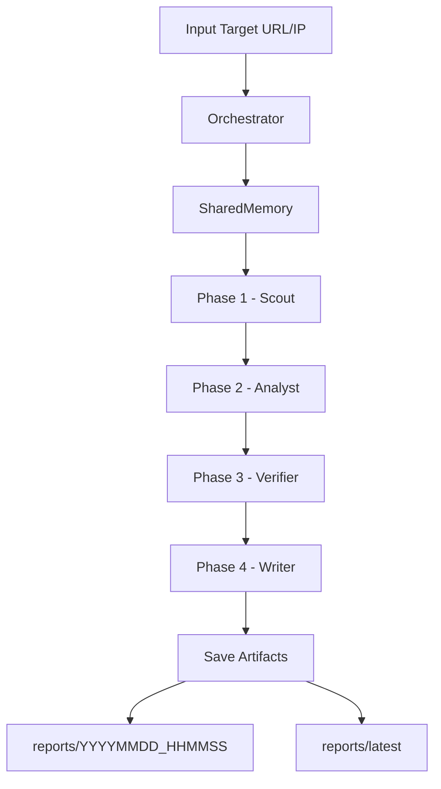

# Context-Aware Multi-Agent System for Web Vulnerability Assessment using LLMs

## 1. Project Summary

Đây là đồ án xây dựng hệ thống đánh giá lỗ hổng web theo kiến trúc multi-agent, có chia sẻ ngữ cảnh giữa các pha và dùng LLM theo hướng phòng thủ (blue-team).

Hệ thống hiện có 4 agent:

1. Scout: thu thập bề mặt tấn công (HTTP probe, endpoint inventory, port/service scan).
2. Analyst: phân tích rủi ro bằng rule-based + LLM.
3. Verifier: xác minh finding, hiệu chỉnh confidence, kiểm tra CVE hint qua NVD API.
4. Writer: tổng hợp báo cáo Markdown chuyên nghiệp.

## 2. Scope and Goal

Mục tiêu: tự động hóa quy trình Web Vulnerability Assessment phục vụ học thuật và demo.

Không phải mục tiêu: công cụ pentest production hoặc khai thác tấn công chủ động.

## 3. System Architecture



Luồng context:

1. Scout ghi dữ liệu recon vào SharedMemory.
2. Analyst đọc recon context để tạo findings.
3. Verifier đọc findings + recon để xác minh và hiệu chỉnh confidence.
4. Writer đọc toàn bộ context để sinh báo cáo cuối.

## 4. Key Features Implemented

1. CLI chạy scan theo target nhập tay hoặc qua tham số.
2. Web UI Streamlit có sidebar run settings, recent runs, findings, report, artifacts.
3. Timeout/fallback logic giúp tránh treo lâu ở target khó phản hồi.
4. Verification layer với các nhãn:
   - verification_status: Verified, Partially Verified, Hypothesis
   - evidence_strength: Strong, Moderate, Weak
5. CVE check qua NVD API cho cve_hint (kèm trạng thái và nguồn).
6. Report Markdown chuẩn trình bày gồm:
   - metadata, summary, recon table, findings table, remediation
   - technical evidence
   - verification summary
   - performance metrics
7. Mỗi lần chạy tạo 1 thư mục output riêng + snapshot latest.

## 5. Project Structure

```text
MultiAgent_Pentest/
|-- main.py
|-- streamlit_app.py
|-- requirements.txt
|-- README.md
|-- .streamlit/config.toml
|-- multiagent_pentest/
|   |-- orchestrator.py
|   |-- shared_memory.py
|   |-- llm_client.py
|   |-- config.py
|   |-- error_handler.py
|   `-- agents/
|       |-- scout_agent.py
|       |-- analyst_agent.py
|       |-- verifier_agent.py
|       `-- writer_agent.py
`-- reports/
```

## 6. Prerequisites

1. Python 3.10+
2. Nmap cài trên hệ điều hành và chạy được lệnh nmap --version
3. OpenAI API key hợp lệ trong file .env

## 7. Setup

### 7.1 Install dependencies

```bash
pip install -r requirements.txt
```

### 7.2 Configure environment

Tạo file .env trong thư mục gốc, ví dụ:

```env
OPENAI_API_KEY=your_key_here
```

## 8. Run Instructions

### 8.1 CLI mode

```bash
python main.py
```

Hoặc:

```bash
python main.py --target http://example.com --model gpt-4o-mini --output-dir reports
```

### 8.2 Web UI mode (default port 8000)

```bash
python -m streamlit run streamlit_app.py
```

Truy cập:

```text
http://localhost:8000
```

## 9. Output Artifacts

Mỗi lần chạy sẽ tạo:

1. reports/YYYYMMDD_HHMMSS/pentest_report_YYYYMMDD_HHMMSS.md
2. reports/YYYYMMDD_HHMMSS/pentest_memory_YYYYMMDD_HHMMSS.json
3. reports/YYYYMMDD_HHMMSS/pentest_execution_YYYYMMDD_HHMMSS.log

Và cập nhật snapshot mới nhất tại reports/latest.

## 10. What Was Improved During Development

1. Tối ưu timeout và fallback để giảm treo scan.
2. Nâng pipeline từ 3 phase lên 4 phase với Verifier Agent.
3. Thêm xác minh finding và hiệu chỉnh confidence.
4. Thêm CVE check qua NVD API.
5. Cải tiến report có evidence và verification summary.
6. Bổ sung UI Streamlit sáng, dễ trình bày, recent runs bấm xem lại được.

## 11. Current Completion Status

Đánh giá cho mục tiêu đồ án:

1. Hoàn chỉnh để demo và bảo vệ.
2. Đáp ứng đề tài Context-Aware Multi-Agent Web Vulnerability Assessment using LLMs.
3. Có bằng chứng đầu ra rõ ràng và tái hiện được.

## 12. Known Limitations

1. Chưa phải production security scanner.
2. CVE verification phụ thuộc NVD API/network.
3. Chưa có benchmark tự động nhiều target trong UI.
4. Chưa có adaptive rescan loop khi confidence thấp.

## 13. Next Improvements (Optional)

1. Thêm benchmark dashboard (thời gian, verified ratio, findings trend).
2. Adaptive re-check cho finding hypothesis cao.
3. Xuất PDF report và dashboard so sánh run.

## 14. Ethics and Safety

Chỉ dùng trên hệ thống bạn sở hữu hoặc đã có văn bản cho phép kiểm thử.

Nghiêm cấm sử dụng dự án này cho hành vi tấn công trái phép.
