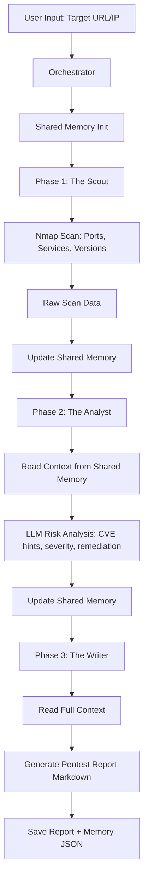

# Context-Aware Multi-Agent Pentest (Build From Scratch)

## Project Idea

Topic: **Context-Aware Multi-Agent System for Web Vulnerability Assessment using LLMs**.

System has 3 agents with shared memory:

1. The Scout (Reconnaissance)
1. The Analyst (Vulnerability Assessment)
1. The Writer (Reporting)

## Workflow Diagram



## File Structure

- `main.py`: CLI entrypoint (gọn, chỉ nhận input và chạy orchestrator).
- `multiagent_pentest/orchestrator.py`: bộ điều phối luồng 3 phase.
- `multiagent_pentest/shared_memory.py`: shared memory dùng chung giữa agents.
- `multiagent_pentest/agents/scout_agent.py`: Agent 1, phụ trách Nmap recon.
- `multiagent_pentest/agents/analyst_agent.py`: Agent 2, phụ trách LLM risk analysis.
- `multiagent_pentest/agents/writer_agent.py`: Agent 3, phụ trách viết báo cáo.
- `multiagent_pentest/llm_client.py`: khởi tạo OpenAI client.
- `multiagent_pentest/config.py`: load env config.
- `requirements.txt`: Python dependencies.
- `.env.example`: environment variable template.
- `reports/`: generated report output folder (auto-created).

## Suggested Team Split (3 Members)

1. Member A - Recon Engineer

- Làm việc chính ở `multiagent_pentest/agents/scout_agent.py`
- Nâng cấp scan profile, parse service banners, tuning Nmap arguments.

1. Member B - Security Analyst

- Làm việc chính ở `multiagent_pentest/agents/analyst_agent.py`
- Cải tiến prompt, chuẩn hóa severity/CVE confidence, thêm rule-based checks.

1. Member C - Report and Integration

- Làm việc chính ở `multiagent_pentest/agents/writer_agent.py` và `multiagent_pentest/orchestrator.py`
- Tối ưu format báo cáo, theo dõi context flow, xử lý output (Markdown/PDF).

## Setup

### 1) Prerequisites

- Python 3.10+
- Nmap installed in OS (`nmap --version` should work)

### 2) Install dependencies

```bash
pip install -r requirements.txt
```

### 3) Configure API key

- Copy `.env.example` to `.env`
- Fill `OPENAI_API_KEY`

## Run

### Interactive target input

```bash
python main.py
```

### CLI target input

```bash
python main.py --target scanme.nmap.org
```

Optional flags:

- `--model gpt-4o-mini`
- `--output-dir reports`

## Output

When finished, system saves:

- `reports/pentest_report_YYYYMMDD_HHMMSS.md`
- `reports/pentest_memory_YYYYMMDD_HHMMSS.json`

## Demo Script for Presentation

1. Show architecture and workflow diagram.
1. Run `python main.py --target scanme.nmap.org`.
1. Explain Shared Memory (`phase_1_recon`, `phase_2_assessment`, `phase_3_report`).
1. Open generated Markdown report and show findings + remediation.
1. Show JSON memory file to prove context-aware flow across agents.

## Important Ethical Note

Use only on systems you own or have explicit written permission to test.
This project is for defensive security learning and reporting.

## Project Docs

- Team assignment: `docs/TEAM_ASSIGNMENT.md`
- Report checklist: `docs/REPORT_CHECKLIST.md`
- **Academic report template (Self-Assessment):** `docs/ACADEMIC_REPORT_TEMPLATE.md` ⭐ **Start here for final submission**
- Prompt evaluation template: `docs/PROMPT_EVALUATION_TEMPLATE.md`
- Windows run guide: `docs/RUN_GUIDE_WINDOWS.md`
